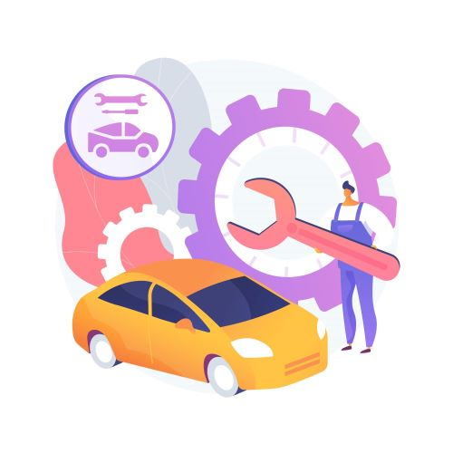

# CARS SERVICE
An online consultant for your car who will help you maintain your car and give detailed answers to all your questions.

## The target audience
Novice drivers who are poorly versed in the design and maintenance of a car, as well as experienced drivers who would find it convenient to use this application.

## What does the program do? 
• Search for all the necessary information specifically about your car;

• Provides clear and detailed algorithms for troubleshooting, including using a voice assistant;

• Has information about all the nearest car services (reviews, prices, call number), about places where you can buy certain parts; 

• Diagnoses a car by the sound of a running engine; 

• Sends reminders about making an appointment at a car service center, the need to undergo a technical inspection, changing tires, turning on headlights, etc.; 

• Information about the main characteristics of various car brands.;

• Has a built-in navigator, with information about the nearest rest areas, gas stations, first-aid posts; 

• Contains information about currency exchange rates and gasoline prices.

This online service will help inexperienced drivers avoid difficulties in servicing their car, and will also make its use more comfortable.

Interface model in Figma
https://www.figma.com/proto/ttLhA3M34Xut5FMCdctf0u/Untitled?node-id=13-43&p=f&t=JWox1wFDcDsp4lAF-0&scaling=scale-down&content-scaling=fixed&page-id=0%3A1&starting-point-node-id=13%3A43
